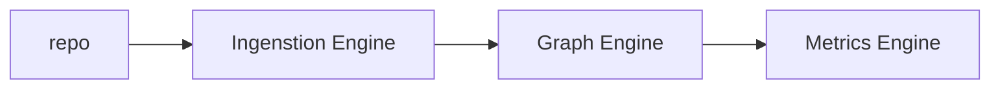

# repo-graph
RepoGraph is a system that transforms source code repositories into structured graph representations, enabling analysis, visualization, and system-level insights. It decomposes codebases into entities and relationships, forming the foundation for scalable observability and intelligent tooling.

## 📚 Table of Contents
- [Overview](#overview)
- [Architecture](#architecture)
- [Subsystems](#subsystems)
- [Diagrams](#diagrams)
- [Tradeoffs](#tradeoffs)

## ⚙️ Architecture

### Ingestion Engine

####overview:
A failure aware subsystem that takes a repo URL and tranforms it into a dictionary that represents the folder structure of a repo, this output will 
be the input for the next layer the graph engine

#### ⚙️ Architecture

```mermaid
graph LR
A[repo]-->B[traversal engine]
B-->C[filtering layer]


