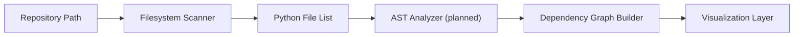

# 📘 Repograph

## 🧠 Overview

Repograph is a Python-based repository analysis tool that scans a codebase and extracts its structural representation.

The current MVP focuses on building a filesystem scanner that traverses a repository and identifies all Python source files (`.py`). This forms the foundation for future static analysis using AST parsing, dependency graph construction, and visualization.

The system is designed as a modular pipeline that evolves from simple file discovery → code analysis → graph modeling → visualization.

---

## ⚙️ Architecture

```mermaid
graph LR
A["Repository Path"] --> B["Filesystem Scanner"]
B --> C["Python File List"]
C --> D["AST Analyzer (planned)"]
D --> E["Dependency Graph Builder"]
E --> F["Visualization Layer"]
```

## 🚧 Phases of Work

### Phase 1 — Filesystem Scanner (Current)
- Accept a repository path as input  
- Traverse the directory structure  
- Identify all `.py` files  
- Return a structured list of file paths  

### Phase 2 — AST Analysis (Planned)
- Parse Python source files using AST  
- Extract imports and module relationships  
- Identify dependencies between files  

### Phase 3 — Dependency Graph (Planned)
- Convert AST results into a graph model  
- Represent relationships between modules as nodes and edges  

### Phase 4 — Visualization Layer (Future)
- Display dependency graph visually  
- Support CLI or web-based visualization  

---

## 🧩 Current Scope (MVP)

The current implementation focuses only on filesystem scanning.

### Responsibilities
- Accept repository path  
- Recursively traverse directories  
- Identify `.py` files  
- Return list of file paths  

---

## ⚠️ Edge Cases

- Invalid repository path → safe failure handling  
- Empty repository → returns empty result  
- No `.py` files → returns empty list  
- Permission denied directories → skipped safely  
- Large repositories → handled via lazy traversal  

---

## 🚀 Future Enhancements

- AST-based dependency extraction  
- Module relationship graph construction  
- `.gitignore` support for realistic scanning  
- Performance optimization for large codebases  
- CLI interface for direct usage  
- FastAPI service wrapper for programmatic access  
- Plugin-based architecture for multi-language support   